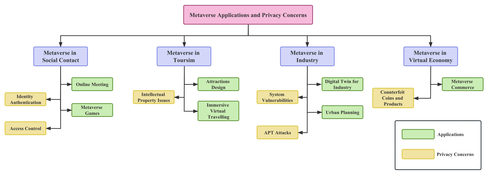
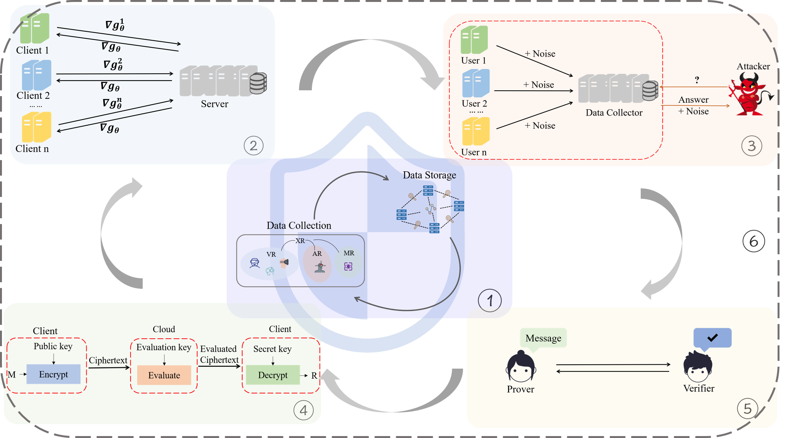

# Awesome-Privacy-Computing-in-Metaverse
    

A collection of papers and implementations for privacy computing in the metaverse.

- [Awesome Privacy Computing in Metaverse](#awesome-privacy-computing-in-metaverse)
  - [Survey](#survey)
  - [Federated Learning in Metaverse](#federated-learning-in-metaverse)
  - [Differential Privacy in Metaverse](#differential-privacy-in-metaverse)
  - [Secure Multi-Party Computing in Metaverse](#secure-multi-party-computing-in-metaverse)
    - [Homomorphic Encryption in Metaverse](#homomorphic-encryption-in-metaverse)
  	- [Zero-Knowledge Proofs in Metaverse](#zero-knowledge-proofs-in-metaverse)
  - [Trusted Execution Environment in Metaverse](#trusted-execution-environment-in-metaverse)
  - [Other Privacy-Enhanced Methods in Metaverse](#other-privacy-enhanced-methods-in-metaverse)
  - [Datasets](#datasets)
  - [Tools](#tools)  

----------
## Metaverse Applications and Privacy Concerns

----------
## Awesome Privacy Computing in Metaverse

----------
## Survey
| Paper Title | Venue | Year | Materials | 
| ---- | :----: | :----: | :----: | 
| Privacy Computing Meets Metaverse: Necessity, Taxonomy and Challenges | Ad Hoc Networks | 2024 | [[Paper](https://arxiv.org/abs/2304.11643)]   [[Code](https://github.com/6lyc/Awesome-Privacy-Computing-in-Metaverse)]|

----------
## Federated Learning in Metaverse
| Paper Title | Venue | Year | Method | Materials | 
| ---- | :----: | :----: | :----: | :----: | 
|Resource Allocation of Federated Learning for the Metaverse with Mobile Augmented Reality | IEEE Transactions on Wireless Communications | 2023 | Zhou et al. | [[Paper](https://arxiv.org/pdf/2211.08705.pdf)] |
|HFedMS: Heterogeneous Federated Learning with Memorable Data Semantics in Industrial Metaverse| IEEE Transactions on Cloud Computing | 2023 | HFedMS | [[Paper](https://arxiv.org/pdf/2211.03300.pdf)] [[Code](https://github.com/slz-ai/hfedms)] |
| Cooperative Federated Learning and Model Update Verification in Blockchain-Empowered Digital Twin Edge Networks | IOTJ | 2022 | Jiang et al. | [[Paper](https://ieeexplore.ieee.org/stamp/stamp.jsp?tp=&arnumber=9606227)] |

----------
## Differential Privacy in Metaverse
| Paper Title | Venue | Year | Method | Materials | 
| ---- | :----: | :----: | :----: | :----: |
| LDP-Based Social Content Protection for Trending Topic Recommendation | IOTJ | 2021 | GCFM | [[Paper](https://ieeexplore.ieee.org/stamp/stamp.jsp?tp=&arnumber=9205204)] |
|Privacy-Preserving Data Aggregation for Mobile Crowdsensing with Externality: An Auction Approach | IEEE/ACM Transactions on Networking | 2023 | DPDA & EDPDA | [[Paper](https://ieeexplore.ieee.org/ielaam/90/9456787/9354053-aam.pdf)] |
|Going Incognito in the Metaverse: Achieving Theoretically Optimal Privacy-Usability Tradeoffs in VR | UIST | 2023 | MetaGuard | [[Paper](https://arxiv.org/pdf/2208.05604.pdf)] [[Code](https://github.com/metaguard/metaguard)] |

----------
## Secure Multi-Party Computing in Metaverse
### Homomorphic Encryption in Metaverse
| Paper Title | Venue | Year | Method | Materials | 
| ---- | :----: | :----: | :----: | :----: | 
| ARMOR: A Secure Combinatorial Auction for Heterogeneous Spectrum | IEEE Transactions on Mobile Computing | 2018 | ARMOR | [[Paper](https://ieeexplore.ieee.org/stamp/stamp.jsp?tp=&arnumber=8493354)] |
|Privacy‐preserving Federated Learning based on Multi‐key Homomorphic Encryption | International Journal of Intelligent Systems | 2022 | xMK‐CKKS | [[Paper](https://arxiv.org/pdf/2104.06824.pdf)] [[Code](https://github.com/snucrypto/HEAAN)] |
### Zero-Knowledge Proofs in Metaverse
| Paper Title | Venue | Year | Method | Materials | 
| ---- | :----: | :----: | :----: | :----: | 
|Self-Sovereign Identity for Trust and Interoperability in the Metaverse | UIC-ATC | 2022 |  SSI + Blockchain | [[Paper](https://ieeexplore.ieee.org/stamp/stamp.jsp?tp=&arnumber=10189537)] |
|Bringing Data Minimization to Digital Wallets at Scale with General-purpose Zero-knowledge proofs | arxiv | 2023 | zk-SNARK for digital wallets | [[Paper](https://arxiv.org/pdf/2301.00823.pdf)] |

----------
## Trusted Execution Environment in Metaverse
| Paper Title | Venue | Year | Method | Materials |
| ---- | :----: | :----: | :----: | :----: |
| CataBEEM: Integrating latent interaction categories in node-wise community detection models for network data | High-Confidence Computing | 2023 | Xu et al. | [[Paper](https://arxiv.org/pdf/2210.12655.pdf)] |
|Extending On-chain Trust to Off-chain – Trustworthy Blockchain Data Collection using Trusted Execution Environment (TEE) | IEEE Transactions on Computers | 2022 | Liu et al. | [[Paper](https://arxiv.org/pdf/2106.15934.pdf)] [[Code](https://github.com/zhuaiballl/TEE-enabled_Trusted_Environment_Monitoring_System)] |

## Other Privacy-Enhanced Methods in Metaverse
| Paper Title | Venue | Year | Method | Materials |
| ---- | :----: | :----: | :----: | :----: |

----------
## Datasets
- xxx: url
 
 ----------
## Tools
- xxx: url

----------
**Disclaimer**

If you have any questions, please feel free to contact us.
Emails: <u>liych78@mail2.sysu.edu.cn</u>